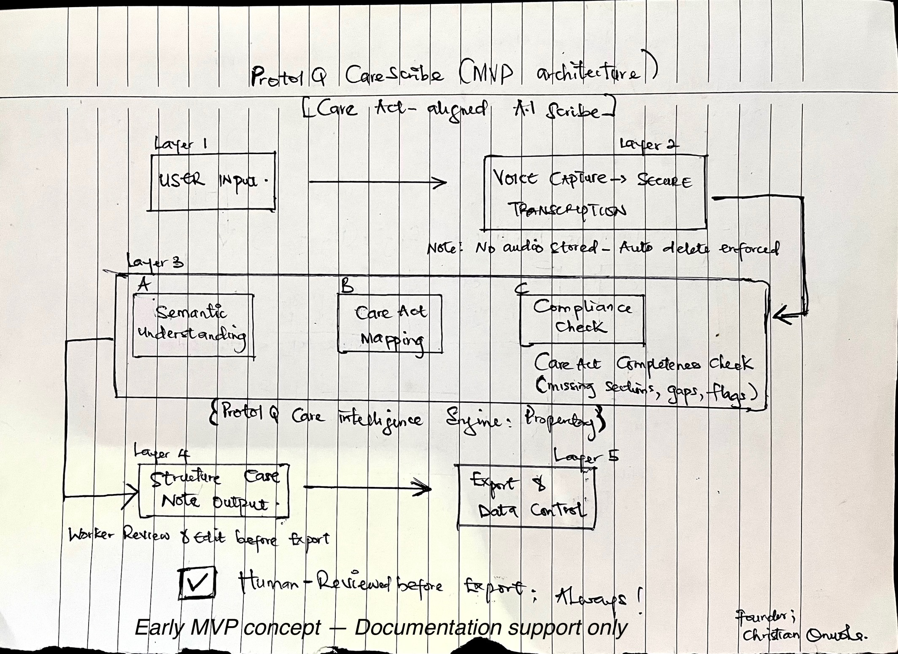

# CareScribe

CareScribe is an early-stage documentation intelligence concept designed to help identify narrative gaps in adult social care records that may create compliance or audit risks.

## The Problem
Care professionals operate under time pressure, and documentation often becomes a retrospective task. Small narrative gaps can later create compliance issues during audits or incident reviews.

## The Experiment
This project explores whether structured documentation logic can help identify those gaps earlier. A prototype simulation was built to test:
* Narrative completeness
* Incident documentation logic
* Risk flagging

## Prototype Simulation
**Live simulation:** [https://carescribe-flow-sim.bubbleapps.io](https://carescribe-flow-sim.bubbleapps.io)

## Repository Structure
* **[foundations/](./foundations/)** → Problem definition & research notes.
* **[product/](./product/)** → Architecture & risk-scoring models.
* **[simulation/](./simulation/)** → Prototype logic & scenarios.
* **[validation/](./validation/)** → User testing framework & logs.
* **[insights/](./insights/)** → Key learnings & false assumptions.

## Architecture

## About
[protol-q-care-scribe.vercel.app](https://protol-q-care-scribe.vercel.app)
